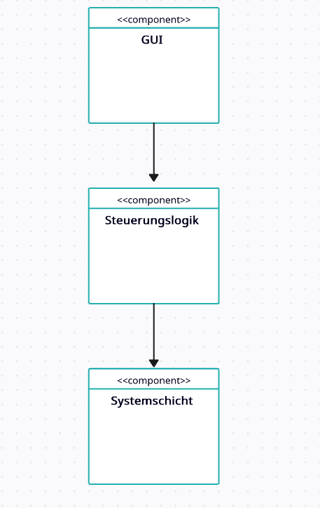

# Softwarearchitektur
Architekturtyp: **Schichten-/Komponentenarchitektur mit Trennung von Logik, Steuerung und GUI**

## Komponentendiagramm

## Hauptkomponenten:
1. GUI-Schicht (Tkinter UI)
- Darstellung und Benutzerinteraktion
- Buttons: Start/Stop
- Anzeigen: Status, Fortschrittsbalken, Reststrahlungszeit, Protokoll

2. Steuerungs- /Logik-Schicht (Controller)
- Überwacht Strahlungsdauer und Ablauf
- Kommuniziert mit GUI
- Steuert Start/Stop und Fortschritt

3. Systemschicht
- Verwaltet Countdown und Zeitablauf
- Liefert Zustandsänderungen an GUI

## Technologien:
- Python
- Tkinter für UI

