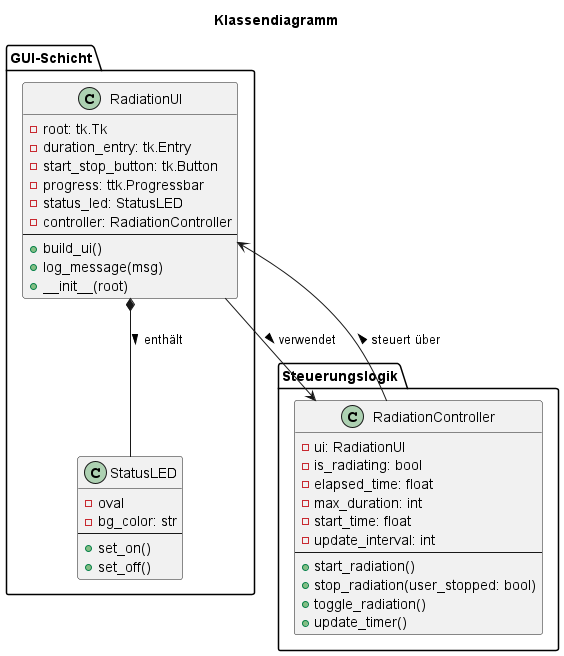
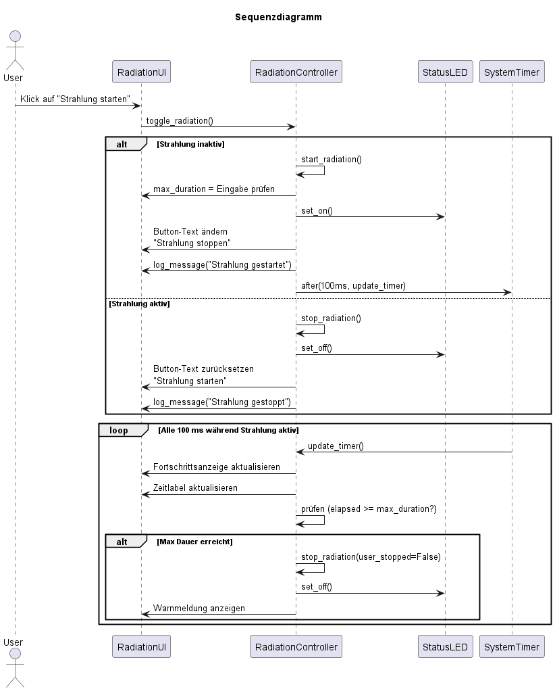

# Design
## Klassendiagramm
Im Folgenden ist ein erster, exemplarischer Entwurf eines Klassendiagramms mit vereinfachten Methoden dargestellt. Die dazugehörigen Komponenten wurden für eine übersichtlichere Abstraktion ebenfalls visualisiert. Verwendet für die Erstellung wurde der Online UML-Editor [PlantUML](https://editor.plantuml.com/).

## Sequenzdiagramm

## Zustandsdiagramm

## Aktualisiertes Komponentendiagramm
Das Komponentendiagramm wurde um Schnittstellen und Klassen ergänzt.

