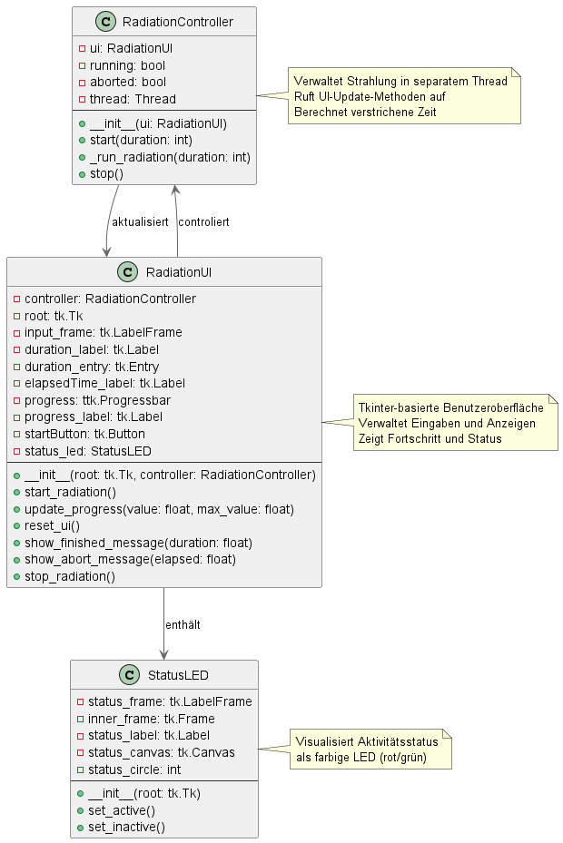
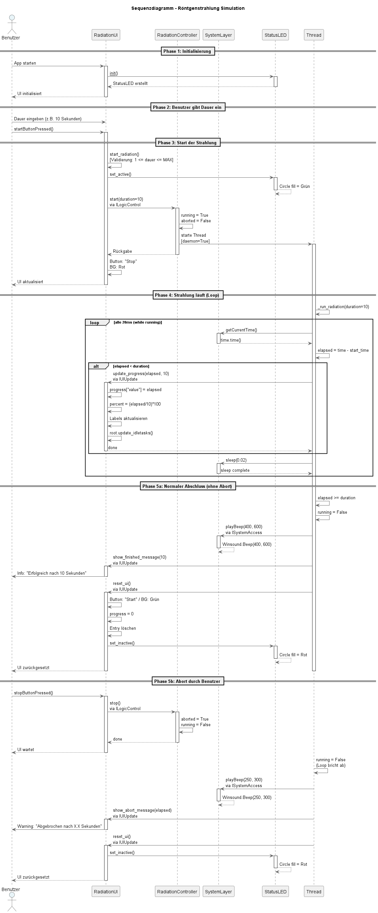
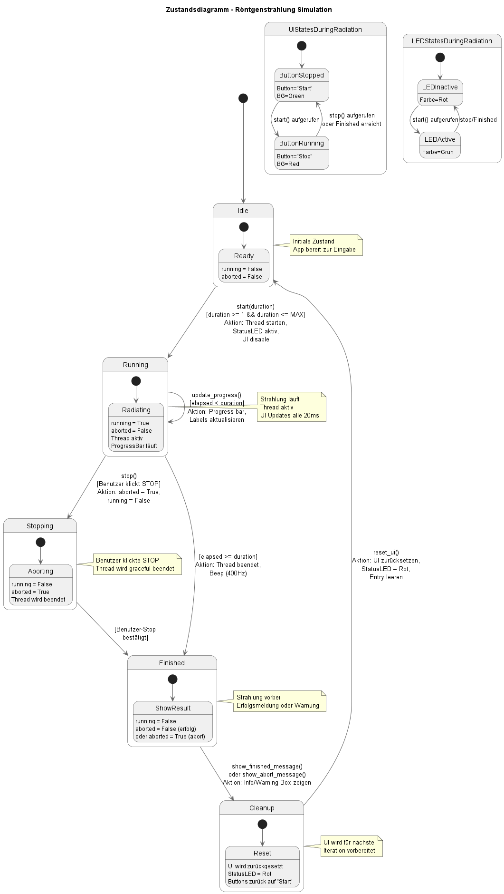
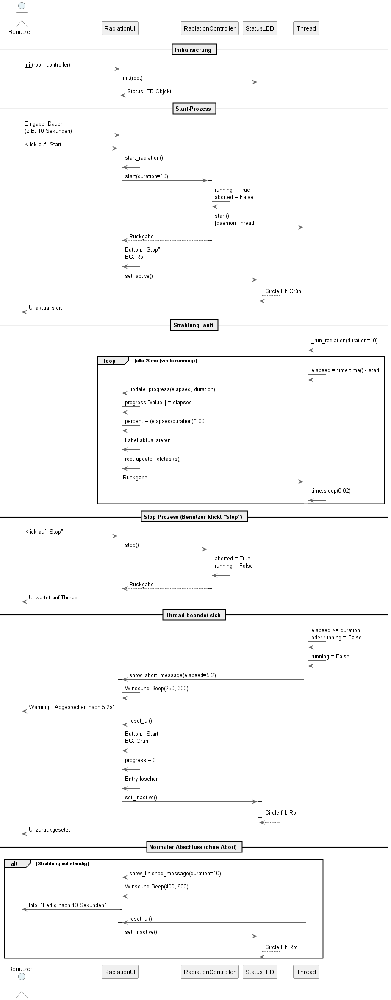

# Design
Im Folgenden sind die Entwürfe eines überarbeiteten Klassendiagramms, Sequenzdiagramms, Zustanddiagramms für den zweiten Sprint dargestellt. Verwendet für die Erstellung wurde der Online UML-Editor [PlantUML](https://editor.plantuml.com/).
## Klassendiagramm


## Sequenzdiagramm


## Zustandsdiagramm


## Kommunikationsdiagramm


## Designpatterns

| Pattern                    | Wo im Projekt                                                            | Grund                                                                                                         |
|----------------------------|--------------------------------------------------------------------------|---------------------------------------------------------------------------------------------------------------|
| **MVC**                    |  GUI (View), RadiationController (Controller), SystemLayer (Model)       | Trennung von Darstellung, Logik und Datenzugriff für bessere Wartbarkeit und Testbarkeit                      |
| **Proxy**                  | SystemLayer abstrahiert OS-/Hardwarezugriffe                             | Systemschicht kapselt Zugriff auf OS-Funktionen (Systemzeit, Sleep, Soundausgabe)                             |
| **Observer**               | `update_progress()`, `show_finished_message()`, `show_abort_message()`   | GUI beobachtet und reagiert auf Zustandsänderungen vom Controller                                             |
| **Facade**                 | GUI spricht nur über `RadiationController`, nicht direkt mit SystemLayer | Vereinfacht Schnittstellen für externe Konsumenten                                                            |
| **Strategy**               | `start()` und `stop()` Methoden als unterschiedliche Strategien          | Unterschiedliche Ausführungsstrategien (Start vs. Stop) mit gleicher Schnittstelle                            |
| **Thread** (Concurrency)   | `_run_radiation()` läuft in separatem Daemon-Thread                      | Verhindert UI-Blockierung und ermöglicht responsive Benutzeroberfläche                                        |
| **State Machine**          | RadiationController mit `running` und `aborted` Flags                    | Modelliert die verschiedenen Zustände der Strahlung (idle, running, stopping, finished)                       |
| **Callback/Event Handler** | UI-Methoden als Callbacks vom Controller aufgerufen                      | Entkopplung von Controller und UI durch asynchrone Kommunikation                                              |

## Architektur-Übersicht

Die Gesamtarchitektur folgt einem **schichtweisen Aufbau**:

```
┌─────────────────────────────────────┐
│   Präsentationsschicht (GUI)         │
│  ┌──────────────┐  ┌──────────────┐ │
│  │ RadiationUI  │  │  StatusLED   │ │
│  └──────────────┘  └──────────────┘ │
└──────────────┬──────────────────────┘
               │ ILogicControl
               ▼
┌─────────────────────────────────────┐
│  Geschäftslogik-Schicht             │
│  ┌─────────────────────────────────┐│
│  │   RadiationController            ││
│  │  - Strahlung verwalten           ││
│  │  - Threading                     ││
│  │  - State Management              ││
│  └─────────────────────────────────┘│
└──────────────┬──────────────────────┘
               │ ISystemAccess
               ▼
┌─────────────────────────────────────┐
│  System-Abstraktions-Schicht        │
│  ┌─────────────────────────────────┐│
│  │   SystemLayer                    ││
│  │  - Zeit (time.time())            ││
│  │  - Sleep (time.sleep())          ││
│  │  - Sound (winsound.Beep())       ││
│  └─────────────────────────────────┘│
└─────────────────────────────────────┘
```
