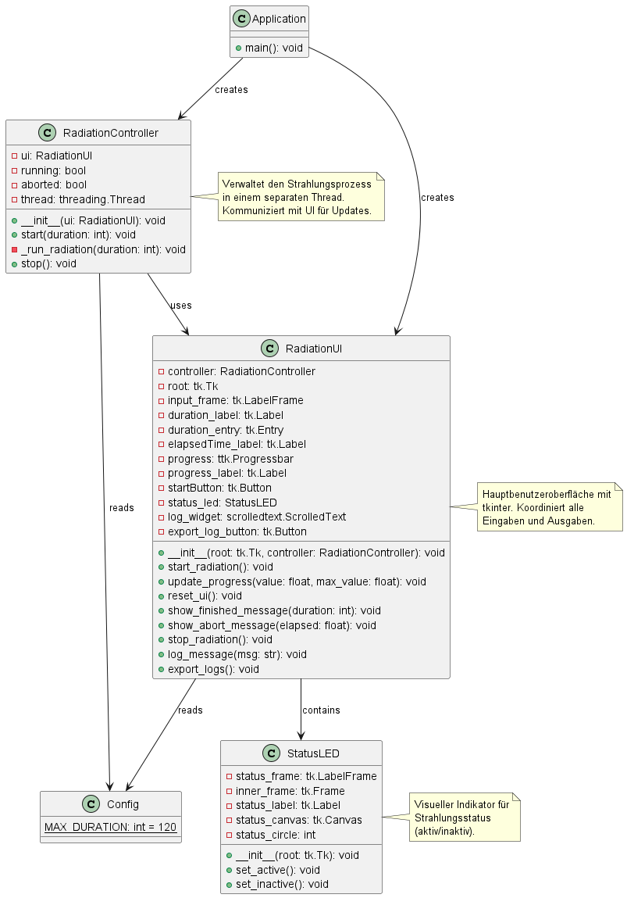
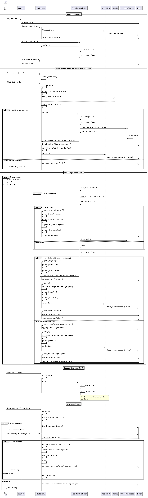
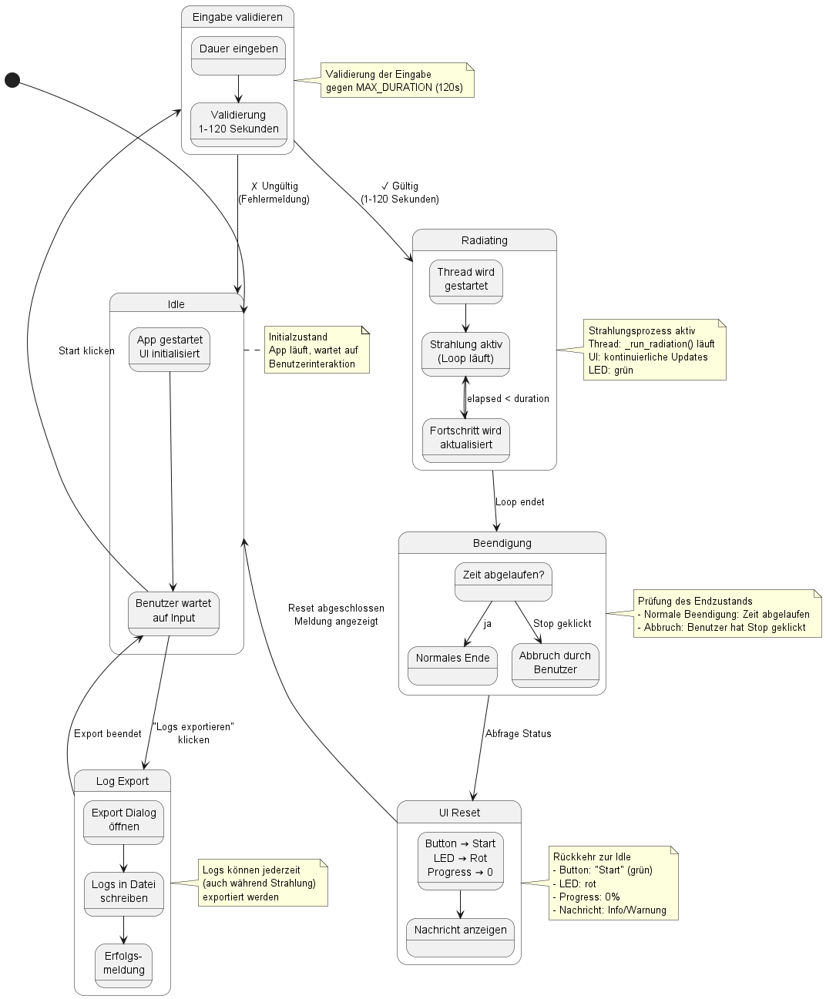
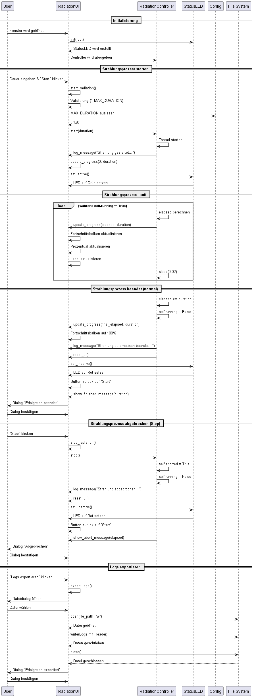

# Design
Im Folgenden sind die Entwürfe eines Klassendiagramms, Sequenzdiagramms, Zustanddiagramms für den dritten Sprint dargestellt. Verwendet für die Erstellung wurde der Online UML-Editor [PlantUML](https://editor.plantuml.com/).
## Klassendiagramm


## Sequenzdiagramm


## Zustandsdiagramm


## Kommunikationsdiagramm


## Designpatterns

| Pattern                    | Wo im Projekt                                                            | Grund                                                                                                         |
|----------------------------|--------------------------------------------------------------------------|---------------------------------------------------------------------------------------------------------------|
| **MVC (Model-View-Controller)** | `RadiationUI` (View), `RadiationController` (Controller), implizite Datenlogik im Controller (Model) | Trennung von Darstellung, Steuerungslogik und Geschäftslogik für bessere Wartbarkeit und Testbarkeit |
| **Observer**               | `update_progress()`, `log_message()`, `show_finished_message()`, `show_abort_message()` | GUI beobachtet Zustandsänderungen des Controllers und reagiert asynchron auf Events |
| **Facade**                 | `RadiationUI` kapselt die gesamte GUI-Komplexität (tkinter Widgets, Layout, Dialoge) | Vereinfacht die Schnittstelle für den Controller - dieser muss nur wenige öffentliche Methoden kennen |
| **State Machine**          | `RadiationController` mit `running` und `aborted` Boolean-Flags | Modelliert die Zustände der Strahlung: Idle → Running → (Finished/Aborted) → Idle |
| **Thread/Concurrency**     | `_run_radiation()` läuft in separatem Daemon-Thread mit `threading.Thread` | Verhindert UI-Blockierung während der Strahlungsausführung und ermöglicht responsive Benutzeroberfläche |
| **Callback/Event Handler** | UI-Button Callbacks (`command=self.start_radiation`, `command=self.stop_radiation`) | Ereignisgesteuerte Kommunikation zwischen GUI und Controller ohne direkte Kopplung |
| **Singleton (implizit)**   | `Config.MAX_DURATION` als Modul-Level Konstante | Zentrale Konfiguration mit globalem Zugriff - nur eine Instanz der Konfigurationsdaten |
| **Composite**              | `StatusLED` als eigenständige Komponente in `RadiationUI` eingebettet | Strukturiert komplexe GUI-Elemente hierarchisch - StatusLED ist wiederverwendbare Komponente |
| **Strategy (implizit)**    | Unterschiedliche Beendigungslogik: normale Beendigung vs. Abbruch | Verschiedene Verhaltensweisen beim Strahlungsende mit gleicher Schnittstelle (`reset_ui()`) |

## Architektur-Übersicht

Die Gesamtarchitektur folgt einem **schichtweisen Aufbau mit MVC-Pattern**:

```
┌─────────────────────────────────────────────────────────┐
│         Präsentationsschicht (View)                      │
│  ┏━━━━━━━━━━━━━━━━━━━━━━━━━━━━━━━━━━━━━━━━━━━━━━━━━┓  │
│  ┃  RadiationUI (main.py, ui.py)                    ┃  │
│  ┃  ┌──────────────┐  ┌──────────────┐             ┃  │
│  ┃  │ Input Widgets│  │ StatusLED    │             ┃  │
│  ┃  │ - Entry      │  │ - Canvas     │             ┃  │
│  ┃  │ - Button     │  │ - Label      │             ┃  │
│  ┃  └──────────────┘  └──────────────┘             ┃  │
│  ┃  ┌──────────────┐  ┌──────────────┐             ┃  │
│  ┃  │ Progressbar  │  │ Log Widget   │             ┃  │
│  ┃  │ - ttk.Bar    │  │ - ScrollText │             ┃  │
│  ┃  └──────────────┘  └──────────────┘             ┃  │
│  ┗━━━━━━━━━━━━━━━━━━━━━━━━━━━━━━━━━━━━━━━━━━━━━━━━━┛  │
└──────────────┬──────────────────────────────────────────┘
               │ Controller Interface
               │ - start(duration)
               │ - stop()
               ▼
┌─────────────────────────────────────────────────────────┐
│       Steuerungsschicht (Controller)                     │
│  ┏━━━━━━━━━━━━━━━━━━━━━━━━━━━━━━━━━━━━━━━━━━━━━━━━━┓  │
│  ┃  RadiationController (controller.py)             ┃  │
│  ┃  - Strahlungsprozess verwalten                   ┃  │
│  ┃  - Threading koordinieren                        ┃  │
│  ┃  - State Management (running/aborted)            ┃  │
│  ┃  - UI-Callbacks aufrufen                         ┃  │
│  ┗━━━━━━━━━━━━━━━━━━━━━━━━━━━━━━━━━━━━━━━━━━━━━━━━━┛  │
└──────────────┬──────────────────────────────────────────┘
               │ Model Interface (implizit)
               │ - Zeit-/Dauerdaten
               │ - Zustandsdaten
               ▼
┌─────────────────────────────────────────────────────────┐
│    Daten & Systemschicht (Model)                         │
│  ┏━━━━━━━━━━━━━━━━━━━━━━━━━━━━━━━━━━━━━━━━━━━━━━━━━┓  │
│  ┃  Config (config.py)                              ┃  │
│  ┃  - MAX_DURATION = 120                            ┃  │
│  ┃                                                   ┃  │
│  ┃  Python Standard Library                         ┃  │
│  ┃  - threading.Thread                              ┃  │
│  ┃  - time.time() / time.sleep()                    ┃  │
│  ┃  - winsound.Beep()                               ┃  │
│  ┃  - tkinter.filedialog                            ┃  │
│  ┃  - datetime                                      ┃  │
│  ┗━━━━━━━━━━━━━━━━━━━━━━━━━━━━━━━━━━━━━━━━━━━━━━━━━┛  │
└─────────────────────────────────────────────────────────┘
```

## Kommunikationsfluss

Die Kommunikation zwischen den Schichten folgt dem **Observer- und Callback-Pattern**:

1. **User → View**: Benutzerinteraktion (Button-Klick, Eingabe)
2. **View → Controller**: Methodenaufruf `start(duration)` oder `stop()`
3. **Controller → Threading**: Neuer Thread für `_run_radiation()` wird gestartet
4. **Controller → View**: Callbacks für UI-Updates (`update_progress()`, `log_message()`)
5. **View → StatusLED**: Zustandsänderungen (`set_active()`, `set_inactive()`)
6. **View → User**: Visuelle Rückmeldung (Fortschrittsbalken, Dialoge, LED-Farbe)